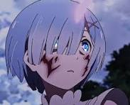

<html lang="es">
<head>
<meta charset="UTF-8">
<meta name="viewport" content="width=device-width, initial-scale=1.0">

<title>Rem | Wiki Anime</title>

</head>
<body>

<header>
    <h1>Rem</h1>
</header>

    <aside class="ficha">

        

        

            <h2>Información</h2>

            
<b>Anime:</b> Re:Zero − Starting Life in Another World

            
<b>Edad:</b> 17 años

            
<b>Altura:</b> 154 cm

            
<b>Cumpleaños:</b> 2 de febrero

            
<b>Raza:</b> Oni

            
<b>Ocupación:</b> Sirvienta

            
<b>Hermana:</b> Ram

        

    </aside>

    <main class="contenido">

        <section class="seccion">

            <h2>Historia</h2>

            

                Rem es una de las gemelas oni que trabajan como
                sirvientas en la mansión de Roswaal junto a su
                hermana Ram.
            

             

            

                Durante su infancia vivió en una aldea oni.
                Mientras Ram era considerada un prodigio,
                Rem creció sintiéndose inferior a ella.
                Tras el ataque que destruyó su aldea y dejó
                a Ram sin su cuerno, Rem desarrolló un fuerte
                sentimiento de culpa y dedicó gran parte de
                su vida a compensar la pérdida de su hermana.
            

             

            

                Con el paso del tiempo comenzó a trabajar en
                la mansión de Roswaal. La llegada de Subaru
                Natsuki cambió profundamente su forma de ver
                la vida y la ayudó a ganar confianza en sí
                misma y encontrar un propósito propio.
            

        </section>

        <section class="seccion">

            <h2>Personalidad</h2>

            

                Rem suele ser reservada, trabajadora y muy
                dedicada a las personas que aprecia. Aunque
                inicialmente puede mostrarse desconfiada,
                demuestra una gran lealtad y amabilidad con
                quienes se ganan su confianza.
            

             

            

                Le gusta ayudar a los demás, cumplir con sus
                responsabilidades y proteger a sus seres
                queridos. Su objetivo es superar sus
                inseguridades y convertirse en alguien de quien
                pueda sentirse orgullosa.
            

        </section>

        <section class="seccion">

            <h2>Habilidades</h2>

            <ul>
                <li><b>Modo Oni:</b> aumenta enormemente su fuerza, velocidad y resistencia.</li>

                <li><b>Magia de agua:</b> puede utilizar hechizos de agua para combatir y apoyar aliados.</li>

                <li><b>Dominio del mayal:</b> maneja con gran habilidad su característica arma de cadena.</li>
            </ul>

        </section>

        <section class="seccion">

            <h2>Galería</h2>

            

                
                
                

            

        </section>

    </main>

<footer>
    REM ES VIDA
</footer>

</body>
</html>
